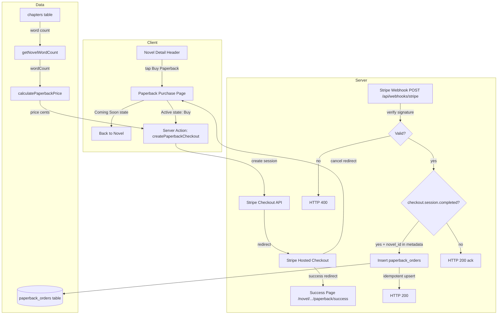

# Design: Buy Paperback

## Overview

This design adds a paperback purchase flow to Midnight Satin, enabling readers to buy physical copies of novels. The feature spans the full purchase lifecycle: a "Buy Paperback" button on the Novel Detail Header, a dedicated purchase page (initially in "Coming Soon" state, later active with Stripe Checkout), price calculation from word count, shipping address collection via Stripe, order recording via webhook, and a success confirmation page.

The feature integrates with the existing Stripe infrastructure already used for credit pack purchases (`src/lib/stripe/config.ts`, `src/app/actions/purchase-credits.ts`, `src/app/api/webhooks/payment/route.ts`). A feature flag (`NEXT_PUBLIC_PAPERBACK_ENABLED`) controls the transition from Coming Soon to active state.

### Key Design Decisions

1. **Reuse existing Stripe patterns**: The credit purchase flow already establishes Stripe Checkout session creation (server action) and webhook-based fulfillment. The paperback flow follows the same architecture.
2. **Separate webhook route**: A new `/api/webhooks/stripe` route handles paperback-specific `checkout.session.completed` events, distinguished from credit purchases by the presence of `novel_id` in session metadata. Alternatively, the existing `/api/webhooks/payment` route could be extended with a discriminator, but a separate route keeps concerns isolated and allows independent Stripe webhook endpoint configuration.
3. **Pure price calculator**: The pricing logic is a pure function with no DB dependencies, making it trivially testable. Word count derivation is a separate async function in the content layer.
4. **Coming Soon as default**: The feature flag defaults to `false`, so the Coming Soon state is the safe default for all environments until Stripe is configured.

## Architecture



### Route Structure

| Route | Type | Purpose |
|-------|------|---------|
| `/novel/[novelId]/paperback` | Page (RSC) | Purchase page (Coming Soon or Active) |
| `/novel/[novelId]/paperback/success` | Page (RSC) | Post-purchase confirmation |
| `/api/webhooks/stripe` | API Route | Stripe webhook for paperback orders |

### New Files

| File | Purpose |
|------|---------|
| `src/app/novel/[novelId]/paperback/page.tsx` | Paperback purchase page |
| `src/app/novel/[novelId]/paperback/success/page.tsx` | Success confirmation page |
| `src/app/novel/[novelId]/paperback/paperback-client.tsx` | Client component for active purchase state (button loading, Stripe redirect) |
| `src/app/actions/paperback.ts` | Server action: `createPaperbackCheckout` |
| `src/app/api/webhooks/stripe/route.ts` | Stripe webhook handler for paperback orders |
| `src/lib/paperback/pricing.ts` | Pure price calculator + types |
| `src/lib/paperback/word-count.ts` | `getNovelWordCount` function |
| `src/lib/db/paperback-orders.ts` | DB operations for `paperback_orders` table |

### Modified Files

| File | Change |
|------|--------|
| `src/app/_components/novel-detail-header.tsx` | Add Buy Paperback button |
| `src/lib/db/types.ts` | Add `PaperbackOrder` interface |
| `src/lib/db/schema.sql` | Add `paperback_orders` table |
| `.env.example` | Document new env vars |

## Components and Interfaces

### NovelDetailHeader (Modified)

Add a `menu_book` icon button to the left group (right of the back button). The button links to `/novel/[novelId]/paperback` using `next/link` or `router.push`.

```tsx
// New button added after the back button, inside the left side
<Link
  href={`/novel/${novelId}/paperback`}
  className="pointer-events-auto flex items-center justify-center w-10 h-10 rounded-full bg-surface/30 backdrop-blur-md text-white border border-white/10 hover:bg-surface/50 transition-colors active:scale-95"
  aria-label="Get the paperback"
>
  <span className="material-symbols-outlined text-shadow-sm">menu_book</span>
</Link>
```

The header currently has a single back button on the left and bookmark+share on the right. The Buy Paperback button sits to the right of the back button, forming a left-side group. This requires wrapping the back button and new button in a flex container.

### PaperbackPurchasePage (Server Component)

The page at `/novel/[novelId]/paperback`:
1. Fetches the novel (title, cover, author name) and word count
2. Checks `NEXT_PUBLIC_PAPERBACK_ENABLED` env var
3. Checks authentication status
4. Renders Coming Soon state or Active state accordingly

### ComingSoonState

Displays when `NEXT_PUBLIC_PAPERBACK_ENABLED !== "true"`:
- Novel cover image, title (Playfair Display, italic, bold), author name
- "Coming Soon" heading (Cinzel, uppercase, gold `text-primary`)
- Personalized body message: "Love doesn't have to stay behind a screen. Get a high-quality, physical edition of {novel title} to keep forever." (Literata)
- Note that this feature is coming soon
- "Back to Novel" button (`btn-gold` styling)
- Back arrow in header

### ActivePurchaseState (Client Component)

Displays when feature is enabled:
- Novel cover, title, author, computed price (formatted as "$X.XX")
- Personalized body message: "Love doesn't have to stay behind a screen. Get a high-quality, physical edition of {novel title} to keep forever." (Literata)
- CTA: "Get an actual paperback copy of this novel shipped to you now!"
- Estimated page count (word count ÷ 250, rounded up)
- "Get The Paperback" button (`btn-gold`) with loading/disabled state
- Login prompt if unauthenticated (with return URL)
- Calls `createPaperbackCheckout` server action, then redirects to Stripe

### SuccessPage (Server Component)

At `/novel/[novelId]/paperback/success`:
- Validates `session_id` query param; redirects to novel page if missing/invalid
- Displays confirmation heading (Cinzel, gold), novel title, price paid
- Note about shipping details collected
- "Back to Novel" button (`btn-gold`)

### Server Action: createPaperbackCheckout

```typescript
// src/app/actions/paperback.ts
"use server";

export type PaperbackCheckoutResult =
  | { success: true; checkoutUrl: string }
  | { success: false; error: string };

export async function createPaperbackCheckout(
  novelId: string
): Promise<PaperbackCheckoutResult>;
```

Flow:
1. Verify authenticated session → error if not
2. Fetch novel (validate exists) → error if not found
3. Compute word count via `getNovelWordCount(novelId)`
4. Compute price via `calculatePaperbackPrice(wordCount)`
5. Create Stripe Checkout session with:
   - `mode: "payment"`
   - Single line item: novel title, price in cents, qty 1
   - `shipping_address_collection` with allowed countries
   - `success_url` and `cancel_url`
   - `metadata: { novel_id, reader_id }`
6. Return checkout URL or error

### Price Calculator

```typescript
// src/lib/paperback/pricing.ts
export interface PricingConfig {
  baseCostCents: number;    // default: 1399 ($13.99)
  perWordRate: number;      // default: 0.00006
  maxPriceCents: number;    // default: 3499 ($34.99)
}

export const DEFAULT_PRICING_CONFIG: PricingConfig = {
  baseCostCents: 1399,
  perWordRate: 0.00006,
  maxPriceCents: 3499,
};

export function calculatePaperbackPrice(
  wordCount: number,
  config?: Partial<PricingConfig>
): number;
```

The function:
1. Merges provided config with defaults
2. Computes: `baseCostCents + Math.round(wordCount * perWordRate * 100)`
3. Caps at `maxPriceCents`
4. Returns integer cents (always ≥ baseCostCents)

Note: The requirements specify the formula as `base cost + (word count × per-word rate)` with the result rounded to two decimal places. Internally we work in cents to avoid floating-point issues. The per-word rate of $0.00006 means 0.006 cents per word, so a 100,000-word novel adds $6.00 to the base. The $13.99 base cost accounts for print-on-demand platform margins (Amazon KDP, Lulu, etc.).

### Word Count Function

```typescript
// src/lib/paperback/word-count.ts
export async function getNovelWordCount(novelId: string): Promise<number>;
export function countWords(text: string): number;
```

- `countWords`: splits on whitespace (`/\s+/`), counts non-empty tokens. Pure function.
- `getNovelWordCount`: fetches all chapter content for the novel, sums `countWords` per chapter.

### Webhook Handler

```typescript
// src/app/api/webhooks/stripe/route.ts
export async function POST(request: NextRequest): Promise<NextResponse>;
```

Follows the same pattern as the existing `/api/webhooks/payment/route.ts`:
1. Verify `STRIPE_SECRET_KEY` and `STRIPE_WEBHOOK_SECRET` are set
2. Read raw body, verify Stripe signature
3. On `checkout.session.completed` with `novel_id` in metadata:
   - Extract `novel_id`, `reader_id`, payment intent, amount, shipping address
   - Insert into `paperback_orders` with `ON CONFLICT (stripe_session_id) DO NOTHING` for idempotency
4. Return HTTP 200

## Data Models

### paperback_orders Table

```sql
CREATE TABLE paperback_orders (
  id UUID PRIMARY KEY DEFAULT gen_random_uuid(),
  reader_id UUID NOT NULL REFERENCES readers(id) ON DELETE CASCADE,
  novel_id UUID NOT NULL REFERENCES novels(id) ON DELETE CASCADE,
  stripe_session_id TEXT UNIQUE NOT NULL,
  stripe_payment_intent_id TEXT,
  amount_cents INT NOT NULL,
  currency TEXT DEFAULT 'usd',
  shipping_name TEXT,
  shipping_address JSONB,
  status TEXT DEFAULT 'paid',
  created_at TIMESTAMPTZ DEFAULT NOW(),
  updated_at TIMESTAMPTZ DEFAULT NOW()
);

CREATE INDEX idx_paperback_orders_reader ON paperback_orders(reader_id);
CREATE INDEX idx_paperback_orders_novel ON paperback_orders(novel_id);
CREATE INDEX idx_paperback_orders_session ON paperback_orders(stripe_session_id);
```

### PaperbackOrder TypeScript Interface

```typescript
// Added to src/lib/db/types.ts
export interface PaperbackOrder {
  id: string;
  readerId: string;
  novelId: string;
  stripeSessionId: string;
  stripePaymentIntentId: string | null;
  amountCents: number;
  currency: string;
  shippingName: string | null;
  shippingAddress: Record<string, unknown> | null;
  status: string;
  createdAt: Date;
  updatedAt: Date;
}
```

### PricingConfig Interface

```typescript
export interface PricingConfig {
  baseCostCents: number;
  perWordRate: number;
  maxPriceCents: number;
}
```

### Shipping Address Shape (from Stripe)

The `shipping_address` JSONB column stores the Stripe shipping address object:

```typescript
interface StripeShippingAddress {
  city: string | null;
  country: string | null;
  line1: string | null;
  line2: string | null;
  postal_code: string | null;
  state: string | null;
}
```

### Allowed Shipping Countries

Configurable list, defaulting to:
```typescript
const ALLOWED_SHIPPING_COUNTRIES = [
  'US', 'CA', 'GB', 'AU',
  // EU member states
  'AT', 'BE', 'BG', 'HR', 'CY', 'CZ', 'DK', 'EE', 'FI', 'FR',
  'DE', 'GR', 'HU', 'IE', 'IT', 'LV', 'LT', 'LU', 'MT', 'NL',
  'PL', 'PT', 'RO', 'SK', 'SI', 'ES', 'SE',
];
```


## Correctness Properties

*A property is a characteristic or behavior that should hold true across all valid executions of a system — essentially, a formal statement about what the system should do. Properties serve as the bridge between human-readable specifications and machine-verifiable correctness guarantees.*

### Property 1: Price calculation with cap

*For any* non-negative integer word count and any valid `PricingConfig`, `calculatePaperbackPrice(wordCount, config)` shall return `min(baseCostCents + round(wordCount * perWordRate * 100), maxPriceCents)`, and the result shall always be an integer ≥ `baseCostCents`.

**Validates: Requirements 3.1, 3.5, 3.6, 3.7**

### Property 2: Word count whitespace splitting

*For any* string, `countWords(text)` shall return the number of non-empty tokens produced by splitting `text` on whitespace boundaries (`/\s+/`). Equivalently, `countWords(text)` equals `text.trim().split(/\s+/).filter(Boolean).length`, and for the empty string or all-whitespace string, it returns 0.

**Validates: Requirements 4.2, 4.3**

### Property 3: Word count additivity across chapters

*For any* list of chapter content strings, the sum of `countWords` applied to each string individually shall equal `countWords` applied to the concatenation of all strings joined by a single space. This ensures that summing per-chapter word counts produces the same result as counting the combined text.

**Validates: Requirements 3.4, 4.4**

### Property 4: Page count estimation

*For any* non-negative integer word count, the estimated page count shall equal `Math.ceil(wordCount / 250)`, with a minimum of 0 for zero words.

**Validates: Requirements 10.7**

### Property 5: Navigation URL correctness

*For any* valid novel ID string, the Buy Paperback button href shall equal `/novel/${novelId}/paperback`, the "Back to Novel" button href on the purchase page shall equal `/novel/${novelId}`, and the "Back to Novel" button href on the success page shall equal `/novel/${novelId}`.

**Validates: Requirements 1.3, 2.6, 9.4**

### Property 6: Feature flag determines page state

*For any* novel, when `NEXT_PUBLIC_PAPERBACK_ENABLED` is not `"true"`, the paperback purchase page shall render the Coming Soon state. When `NEXT_PUBLIC_PAPERBACK_ENABLED` is `"true"`, the page shall render the active purchase state.

**Validates: Requirements 2.2, 10.1**

### Property 7: Coming Soon state renders novel data

*For any* novel with a title and author name, the Coming Soon state shall include both the novel title and author name in its rendered output.

**Validates: Requirements 2.3**

### Property 8: Checkout session params correctness

*For any* novel (with title and computed price) and any authenticated reader, the Stripe Checkout session creation params shall include: a line item with the novel title as product name and the computed price in cents as `unit_amount`; a `success_url` matching `/novel/${novelId}/paperback/success?session_id={CHECKOUT_SESSION_ID}`; a `cancel_url` matching `/novel/${novelId}/paperback`; and metadata containing both `novel_id` and `reader_id`.

**Validates: Requirements 5.3, 5.5, 5.6**

### Property 9: Error message sanitization

*For any* Stripe API error, the server action shall return an error message that does not contain the original Stripe error message, API key fragments, or request IDs.

**Validates: Requirements 5.7**

### Property 10: Webhook creates order from valid event

*For any* valid `checkout.session.completed` Stripe event containing `novel_id` and `reader_id` in metadata, the webhook handler shall insert a row into `paperback_orders` with the correct `stripe_session_id`, `amount_cents`, `reader_id`, `novel_id`, and shipping address from the session.

**Validates: Requirements 7.3**

### Property 11: Webhook idempotency

*For any* valid `checkout.session.completed` event, processing it N times (N ≥ 1) shall result in exactly one row in `paperback_orders` for that `stripe_session_id`. The second and subsequent processings shall not create duplicates or modify the existing record.

**Validates: Requirements 7.4, 8.6**

### Property 12: Webhook rejects invalid signatures

*For any* request body and any signature string that does not match the HMAC computed with `STRIPE_WEBHOOK_SECRET`, the webhook handler shall return HTTP 400 and not create any order records.

**Validates: Requirements 8.2, 8.3**

### Property 13: Success page displays order info

*For any* completed order with a valid `session_id`, the success page shall display the novel title and the amount paid.

**Validates: Requirements 9.2, 9.3**

### Property 14: Success page redirects on invalid session

*For any* request to the success page where the `session_id` query parameter is missing or does not correspond to a valid Stripe session, the page shall redirect to `/novel/${novelId}`.

**Validates: Requirements 9.6**

### Property 15: Active state displays formatted price

*For any* novel with a computed price in cents, the active purchase state shall display the price formatted as a USD string (e.g., `$14.99` for 1499 cents).

**Validates: Requirements 10.2**

### Property 16: Login prompt includes return URL

*For any* novel ID and unauthenticated reader, the login prompt on the active purchase page shall include a link to the login page with a return URL parameter pointing to `/novel/${novelId}/paperback`.

**Validates: Requirements 10.6**

### Property 17: Buy button disabled during loading

*For any* active purchase state where the checkout session creation is in progress, the "Get The Paperback" button shall be disabled and display a loading indicator.

**Validates: Requirements 10.5**

## Error Handling

### Server Action Errors (createPaperbackCheckout)

| Condition | Behavior |
|-----------|----------|
| Reader not authenticated | Return `{ success: false, error: "Sign in to purchase a paperback." }` |
| Novel not found | Return `{ success: false, error: "Novel not found." }` |
| Stripe not configured (`STRIPE_SECRET_KEY` missing) | Return `{ success: false, error: "Payment system is not configured. Please try again later." }` |
| Stripe API error | Log full error server-side; return `{ success: false, error: "Failed to start checkout. Please try again." }` |
| Stripe returns no checkout URL | Return `{ success: false, error: "Failed to create checkout session. Please try again." }` |

### Webhook Errors (/api/webhooks/stripe)

| Condition | HTTP Status | Behavior |
|-----------|-------------|----------|
| Missing `STRIPE_SECRET_KEY` or `STRIPE_WEBHOOK_SECRET` | 500 | Log config error, return `{ error: "Webhook not configured" }` |
| Missing `stripe-signature` header | 400 | Return `{ error: "Missing stripe-signature" }` |
| Invalid signature | 400 | Log verification failure, return `{ error: "<verification message>" }` |
| Non-`checkout.session.completed` event | 200 | Acknowledge with `{ received: true }` |
| Missing `novel_id` or `reader_id` in metadata | 400 | Log missing metadata, return `{ error: "Missing session metadata" }` |
| Duplicate `stripe_session_id` (idempotent) | 200 | Skip insert, return `{ received: true }` |
| DB insert error | 500 | Log error, return `{ error: "Failed to record order" }` |

### Purchase Page Errors

| Condition | Behavior |
|-----------|----------|
| Novel not found (invalid `novelId`) | Return Next.js `notFound()` |
| Feature flag off | Show Coming Soon state (not an error) |
| Reader not authenticated (active state) | Show login prompt with return URL |
| Checkout creation fails | Display error message from server action in a toast/alert on the page |

### Success Page Errors

| Condition | Behavior |
|-----------|----------|
| Missing `session_id` query param | Redirect to `/novel/${novelId}` |
| Invalid/expired `session_id` | Redirect to `/novel/${novelId}` |

## Testing Strategy

### Property-Based Testing

Property-based tests use `fast-check` (already in devDependencies) with Vitest. Each property test runs a minimum of 100 iterations and references its design document property.

Tests live in `src/__tests__/properties/paperback.test.ts` (and related files), following the existing project convention.

**Tag format:** `Feature: buy-paperback, Property {N}: {title}`

#### Pure Function Properties (no mocking needed)

| Property | Test Approach |
|----------|---------------|
| Property 1: Price calculation with cap | Generate random `wordCount` (0–1,000,000) and random `PricingConfig`. Assert result equals `min(base + round(wc * rate * 100), max)` and result ≥ base. |
| Property 2: Word count whitespace splitting | Generate random strings with varied whitespace (tabs, newlines, multiple spaces). Assert `countWords` matches reference implementation. |
| Property 3: Word count additivity | Generate random arrays of strings. Assert sum of individual `countWords` equals `countWords` of joined string. |
| Property 4: Page count estimation | Generate random word counts. Assert `estimatePageCount(wc)` equals `Math.ceil(wc / 250)`. |

#### Integration Properties (require mocking Stripe/DB)

| Property | Test Approach |
|----------|---------------|
| Property 8: Checkout session params | Mock Stripe client. Generate random novel titles, prices, reader IDs. Assert the `stripe.checkout.sessions.create` call contains correct params. |
| Property 9: Error sanitization | Generate random Stripe error messages. Assert returned error does not contain the original message. |
| Property 11: Webhook idempotency | Mock DB. Send the same event payload twice. Assert only one insert occurs. |
| Property 12: Webhook rejects invalid signatures | Generate random bodies and invalid signatures. Assert HTTP 400 response. |

### Unit Tests

Unit tests cover specific examples, edge cases, and integration points. They live in `src/__tests__/unit/paperback.test.ts`.

| Test | What it verifies |
|------|-----------------|
| Price with 0 words returns base cost | Edge case for Property 1 (Req 3.6) |
| Price with very large word count hits cap | Edge case for Property 1 (Req 3.7) |
| Default config values | Req 3.2, 3.3 |
| `countWords("")` returns 0 | Edge case for Property 2 |
| `countWords` with only whitespace returns 0 | Edge case for Property 2 (Req 4.3) |
| Checkout session includes shipping countries | Req 5.4, 6.1, 6.2 |
| Unauthenticated checkout returns auth error | Req 5.8 |
| Success page with valid session renders title | Req 9.2 |
| Success page without session_id redirects | Req 9.6 |
| Feature flag false renders Coming Soon | Req 2.2 |
| Feature flag true renders active state | Req 10.1 |
| Buy Paperback button has correct aria-label | Req 1.4 |
| Coming Soon shows "Coming Soon" heading | Req 2.4 |

### Test Configuration

- **Runner:** Vitest (`npm run test`)
- **PBT Library:** `fast-check` v4.x (already installed)
- **Minimum iterations:** 100 per property test
- **Environment:** Node (per `vitest.config.ts`)
- **Each property test MUST be implemented as a single `fc.assert(fc.property(...))` call**
- **Each property test MUST include a comment referencing the design property:** `// Feature: buy-paperback, Property N: Title`
