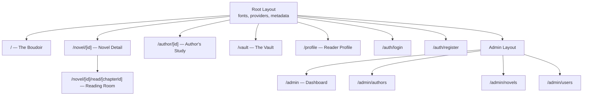
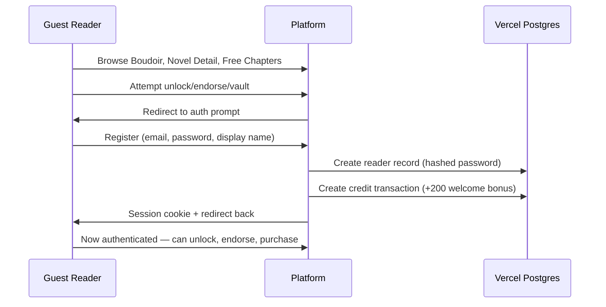
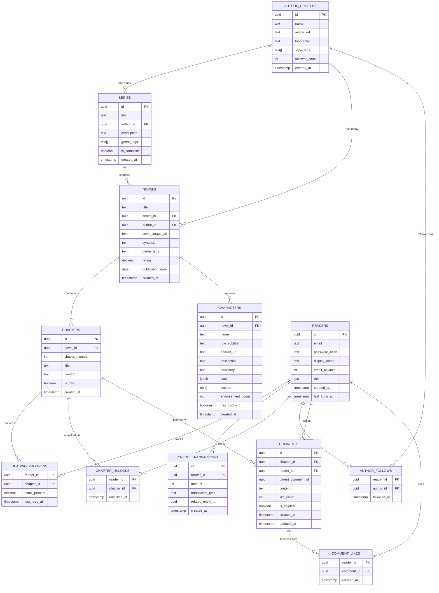

# Design Document: Midnight Satin Platform

## Overview

Midnight Satin is a premium romance reading web application built with Next.js 16 (App Router), React 19, TypeScript, and Tailwind CSS, deployed on Vercel. The platform delivers a "Tactile Noir Luxury" experience across six core screens: The Boudoir (Home), Novel Detail, The Reading Room, The Cast Gallery, The Author's Study, and The Vault (Store). Content is AI-generated via an MCP interface, monetized through a credit-based economy, and managed through an admin dashboard.

The architecture follows a server-first approach using React Server Components for data fetching, Server Actions for mutations, and Vercel's infrastructure stack (Postgres, Blob, KV) for persistence, asset storage, and caching. The design system enforces onyx backgrounds, metallic gold accents, and premium serif typography throughout.

## Architecture

### Next.js 16 App Router Structure

```
src/app/
├── layout.tsx                    # Root layout (fonts, global providers, metadata)
├── globals.css                   # Design system CSS custom properties + Tailwind
├── page.tsx                      # The Boudoir (Home) — "/"
├── novel/
│   └── [novelId]/
│       ├── page.tsx              # Novel Detail Screen
│       └── read/
│           └── [chapterId]/
│               └── page.tsx      # The Reading Room
├── author/
│   └── [authorId]/
│       └── page.tsx              # The Author's Study
├── vault/
│   └── page.tsx                  # The Vault (Store)
├── profile/
│   └── page.tsx                  # Reader Profile / Library
├── auth/
│   ├── login/
│   │   └── page.tsx              # Login page
│   └── register/
│       └── page.tsx              # Registration page
├── admin/
│   ├── layout.tsx                # Admin layout with sidebar nav
│   ├── page.tsx                  # Admin dashboard overview
│   ├── authors/
│   │   └── page.tsx              # Author CRUD
│   ├── series/
│   │   └── page.tsx              # Series CRUD
│   ├── novels/
│   │   └── page.tsx              # Novel CRUD
│   ├── chapters/
│   │   └── page.tsx              # Chapter CRUD
│   ├── characters/
│   │   └── page.tsx              # Character CRUD
│   └── users/
│       └── page.tsx              # User management
├── api/
│   ├── auth/
│   │   └── [...nextauth]/
│   │       └── route.ts          # Auth API routes
│   ├── mcp/
│   │   └── route.ts              # MCP server HTTP endpoint
│   └── webhooks/
│       └── payment/
│           └── route.ts          # Payment webhook handler
└── _components/                  # Shared components
    ├── navigation-bar.tsx        # Sticky bottom nav
    ├── hero-carousel.tsx         # Home hero section
    ├── novel-card.tsx            # Reusable novel card
    ├── character-portrait.tsx    # Circular character avatar
    ├── cast-gallery-modal.tsx    # Full-screen cast gallery
    ├── the-veil.tsx              # Chapter paywall overlay
    ├── credit-balance.tsx        # Credit display widget
    ├── shimmer-placeholder.tsx   # Loading skeleton
    └── empty-state.tsx           # Empty state message
```

### Route Layout



### Component Hierarchy

The Navigation Bar renders on all primary screens (Boudoir, Profile, Vault) but is hidden on the Reading Room and Cast Gallery modal. The Cast Gallery renders as a modal overlay triggered from the Novel Detail screen. The Veil component renders conditionally within the Reading Room when a reader scrolls past free content.

### Rendering Strategy

| Route | Strategy | Rationale |
|-------|----------|-----------|
| `/` (Boudoir) | ISR (60s revalidation) | Featured/trending content changes infrequently |
| `/novel/[id]` | ISR (60s revalidation) | Novel metadata is relatively static |
| `/novel/[id]/read/[chapterId]` | SSR (dynamic) | Requires auth check for locked chapters |
| `/author/[id]` | ISR (60s revalidation) | Author profiles change infrequently |
| `/vault` | SSR (dynamic) | Needs real-time credit balance |
| `/admin/*` | SSR (dynamic) | Always needs fresh data |


## Components and Interfaces

### Screen Components Breakdown

#### 1. The Boudoir (Home) — `page.tsx`

Components:
- `HeroCarousel` — 350px+ hero with featured novel covers, vignette edges, "Editor's Choice" label, CTA button
- `CurrentAffairsSection` — Currently reading card with cover (2:3), title (Playfair Display), author (Marcellus), chapter indicator, gold progress bar
- `HighSocietySection` — Horizontally scrollable trending novels with cover, title, author, optional star badge
- `VaultTeaserCard` — Gold gradient promo card linking to Vault
- `NavigationBar` — Sticky bottom nav (Boudoir, Library, Vault, Profile) with active gold glow
- `ShimmerPlaceholder` — Loading skeleton in dark grey/gold gradient
- `EmptyState` — Pinyon Script gold text for empty sections

#### 2. Novel Detail Screen — `novel/[novelId]/page.tsx`

Components:
- `ParallaxHero` — 65vh cover image with gradient overlay, title (Playfair Display italic bold 4xl), author link
- `MetadataPills` — Genre tags with 1px gold border
- `SynopsisSection` — Expandable text (3 lines visible, "Read More" toggle)
- `PlayersSection` — Horizontal scroll of circular character portraits (80px, gold border)
- `ChapterList` — Vertical list with chapter number, title, "Free" text or gold lock icon
- `FloatingActionButton` — Gold circle (64px) bottom-right, navigates to first unread chapter

#### 3. The Reading Room — `novel/[novelId]/read/[chapterId]/page.tsx`

Components:
- `ChapterContent` — Literata 18px, 1.6 line-height, justified, 24px margins, void black background
- `DropCap` — First letter in Playfair Display 3.5rem, primary gold
- `OrnamentalDivider` — Filigree SVG in gold between sections
- `ReadingHUD` — Toggle overlay with back button, chapter title, font settings, progress %, chapter nav
- `ProgressBar` — Gold line with glow at footer HUD
- `TheVeil` — Paywall overlay with progressive blur (1px, 3px, 6px), lock icon, "The Veil is Drawn" heading (Cinzel), unlock button (5 credits), balance display

#### 4. The Cast Gallery — `_components/cast-gallery-modal.tsx`

Components:
- `CastGalleryModal` — Full-screen modal, swipeable cards at 75vh
- `CharacterCard` — Full-height portrait background, gradient overlay, name (Playfair Display italic 4xl), role subtitle (Marcellus), description
- `DossierCard` — 3D flip animation (700ms), stats grid (Age, Status, Height, Occupation, Zodiac Sign, Blood Type, Birthday), "Tastes & Temptations" subsection (character favorites and notable dislikes, e.g., foods, music, haunts), secrets section (burgundy accent bar), background text
- `TrophyBadge` — Animated pulsing gold glow (3s cycle) when endorsements > 1000
- `EndorsementFAB` — 64px burgundy circle with rose icon, endorsement count (Playfair Display bold gold)
- `NavigationArrows` — Left/right arrows visible on tablet/desktop

#### 5. The Author's Study — `author/[authorId]/page.tsx`

Components:
- `HexagonAvatar` — Hexagonal clip-path mask with gold gradient border
- `AuthorHeader` — Name (Playfair Display italic 3xl), genre tags (Marcellus), stats row (works, followers, rating)
- `BiographySection` — Centered italic quote with decorative quotation marks, writing style hashtag pills
- `TrophyCase` — 3-column grid of trophies with icons, names, descriptions
- `BibliographySection` — Novels grouped by Series, each with cover (80x112px), title, synopsis excerpt, rating, year
- `FollowButton` — Gold CTA that toggles follow state

#### 6. The Vault (Store) — `vault/page.tsx`

Components:
- `CreditBalanceDisplay` — Large number (Playfair Display italic bold 6xl) with gold text gradient
- `CreditPackGrid` — Grid of 4 packs: Pouch of Dust (50/$4.99), Handful of Gold (150/$12.99, "Most Popular"), Chest of Riches (500/$39.99), Royal Treasury (1200/$89.99)
- `PopularRibbon` — Burgundy ribbon badge on highlighted pack with 1.02x scale and gold shimmer
- `CoinRainAnimation` — CSS animation on successful purchase
- `LegalLinks` — Terms of Service and Privacy Policy links

#### 7. Reader Profile & Library — `profile/page.tsx`

Components:
- `ProfileHeader` — Reader avatar (initials-based or uploaded), display name in Playfair Display italic 2xl, obfuscated email, and credit balance pill
- `ReadingStatsRow` — Horizontal pills showing chapters read, hours read estimate, roses sent, authors followed
- `LibrarySectionList` — Two grouped lists: "Currently Reading" (active novels with incomplete chapters) and "Finished" (novels with all chapters completed)
- `LibraryNovelCard` — Compact novel card with cover thumbnail, title, author, last-read chapter, and "Resume" / "View Details" CTA
- `FollowedAuthorsStrip` — Horizontally scrollable list of followed Author_Profile avatars linking to the Author's Study
- `AccountActionsList` — List of actions: Edit Display Name, Manage Email (stub for future), View Transactions, Logout

### Server Actions

```typescript
// Content reading
async function getNovel(novelId: string): Promise<Novel>
async function getChapter(chapterId: string): Promise<Chapter>
async function getCharacters(novelId: string): Promise<Character[]>
async function getAuthor(authorId: string): Promise<AuthorProfile>
async function getFeaturedNovels(): Promise<Novel[]>
async function getTrendingNovels(): Promise<Novel[]>

// User actions
async function unlockChapter(chapterId: string): Promise<{ success: boolean; newBalance: number }>
async function endorseCharacter(characterId: string): Promise<{ success: boolean; newBalance: number; newCount: number }>
async function followAuthor(authorId: string): Promise<{ success: boolean; newFollowerCount: number }>
async function saveReadingProgress(chapterId: string, scrollPercent: number): Promise<void>
async function getReadingProgress(readerId: string): Promise<ReadingProgress[]>

// Comments
async function getChapterComments(chapterId: string, options?: { cursor?: string; limit?: number }): Promise<CommentThreadPage>
async function postComment(chapterId: string, content: string, parentCommentId?: string): Promise<Comment>
async function editComment(commentId: string, content: string): Promise<Comment>
async function deleteComment(commentId: string): Promise<void>
async function likeComment(commentId: string): Promise<{ newLikeCount: number }>
async function unlikeComment(commentId: string): Promise<{ newLikeCount: number }>

// Auth
async function registerReader(email: string, password: string, displayName: string): Promise<{ success: boolean; readerId: string }>
async function loginReader(email: string, password: string): Promise<{ success: boolean; session: Session }>
async function logoutReader(): Promise<void>

// Payments
async function purchaseCredits(packId: string, paymentToken: string): Promise<{ success: boolean; newBalance: number }>

// Admin
async function getContentOverview(): Promise<ContentStats>
async function getUserAnalytics(): Promise<UserAnalytics>
async function adjustUserCredits(readerId: string, amount: number, reason: string): Promise<void>
```

### MCP Interface

The MCP server exposes tools for content agents to create and manage all content types. It runs as an HTTP endpoint at `/api/mcp` and authenticates via API key.

```typescript
// MCP Tools
interface MCPTools {
  create_author(params: { name: string; biography: string; avatar_url: string; style_tags: string[] }): Promise<{ id: string }>
  create_series(params: { title: string; author_id: string; description: string; genre_tags: string[] }): Promise<{ id: string }>
  create_novel(params: { title: string; series_id: string; cover_image_url: string; synopsis: string; genre_tags: string[] }): Promise<{ id: string }>
  create_chapter(params: { novel_id: string; chapter_number: number; title: string; content: string; is_free: boolean }): Promise<{ id: string }>
  create_character(params: { novel_id: string; name: string; role: string; portrait_url: string; description: string; backstory: string; stats: CharacterStats; secrets: string[] }): Promise<{ id: string }>
  list_content(params: { type: 'authors' | 'series' | 'novels' | 'characters'; filter_by?: { author_id?: string; series_id?: string } }): Promise<ContentItem[]>
  update_content(params: { type: string; id: string; updates: Record<string, unknown> }): Promise<{ success: boolean }>
}
```

### Authentication Flow



Session management uses HTTP-only secure cookies with JWT tokens. The session stores the reader ID and is validated on each protected request via Edge middleware.


## Data Models

### Database Schema (Vercel Postgres)



### SQL Schema

```sql
CREATE TABLE author_profiles (
  id UUID PRIMARY KEY DEFAULT gen_random_uuid(),
  name TEXT NOT NULL,
  avatar_url TEXT,
  biography TEXT,
  style_tags TEXT[] DEFAULT '{}',
  follower_count INT DEFAULT 0,
  created_at TIMESTAMPTZ DEFAULT NOW()
);

CREATE TABLE series (
  id UUID PRIMARY KEY DEFAULT gen_random_uuid(),
  title TEXT NOT NULL,
  author_id UUID NOT NULL REFERENCES author_profiles(id) ON DELETE CASCADE,
  description TEXT,
  genre_tags TEXT[] DEFAULT '{}',
  is_complete BOOLEAN DEFAULT FALSE,
  created_at TIMESTAMPTZ DEFAULT NOW()
);

CREATE TABLE novels (
  id UUID PRIMARY KEY DEFAULT gen_random_uuid(),
  title TEXT NOT NULL,
  series_id UUID REFERENCES series(id) ON DELETE SET NULL,
  author_id UUID NOT NULL REFERENCES author_profiles(id) ON DELETE CASCADE,
  cover_image_url TEXT,
  synopsis TEXT,
  genre_tags TEXT[] DEFAULT '{}',
  rating DECIMAL(3,2) DEFAULT 0.00,
  publication_date DATE,
  created_at TIMESTAMPTZ DEFAULT NOW()
);

CREATE TABLE chapters (
  id UUID PRIMARY KEY DEFAULT gen_random_uuid(),
  novel_id UUID NOT NULL REFERENCES novels(id) ON DELETE CASCADE,
  chapter_number INT NOT NULL,
  title TEXT NOT NULL,
  content TEXT NOT NULL,
  is_free BOOLEAN DEFAULT FALSE,
  created_at TIMESTAMPTZ DEFAULT NOW(),
  UNIQUE(novel_id, chapter_number)
);

CREATE TABLE characters (
  id UUID PRIMARY KEY DEFAULT gen_random_uuid(),
  novel_id UUID NOT NULL REFERENCES novels(id) ON DELETE CASCADE,
  name TEXT NOT NULL,
  role_subtitle TEXT,
  portrait_url TEXT,
  description TEXT,
  backstory TEXT,
  stats JSONB DEFAULT '{}',
  secrets TEXT[] DEFAULT '{}',
  endorsement_count INT DEFAULT 0,
  has_trophy BOOLEAN DEFAULT FALSE,
  created_at TIMESTAMPTZ DEFAULT NOW()
);

CREATE TABLE readers (
  id UUID PRIMARY KEY DEFAULT gen_random_uuid(),
  email TEXT UNIQUE NOT NULL,
  password_hash TEXT NOT NULL,
  display_name TEXT,
  credit_balance INT DEFAULT 0,
  role TEXT DEFAULT 'reader',
  created_at TIMESTAMPTZ DEFAULT NOW(),
  last_login_at TIMESTAMPTZ
);

CREATE TABLE reading_progress (
  reader_id UUID NOT NULL REFERENCES readers(id) ON DELETE CASCADE,
  chapter_id UUID NOT NULL REFERENCES chapters(id) ON DELETE CASCADE,
  scroll_percent DECIMAL(5,2) DEFAULT 0.00,
  last_read_at TIMESTAMPTZ DEFAULT NOW(),
  PRIMARY KEY (reader_id, chapter_id)
);

CREATE TABLE credit_transactions (
  id UUID PRIMARY KEY DEFAULT gen_random_uuid(),
  reader_id UUID NOT NULL REFERENCES readers(id) ON DELETE CASCADE,
  amount INT NOT NULL,
  transaction_type TEXT NOT NULL CHECK (transaction_type IN ('purchase', 'chapter_unlock', 'endorsement', 'welcome_bonus', 'admin_adjustment')),
  related_entity_id UUID,
  created_at TIMESTAMPTZ DEFAULT NOW()
);

CREATE TABLE chapter_unlocks (
  reader_id UUID NOT NULL REFERENCES readers(id) ON DELETE CASCADE,
  chapter_id UUID NOT NULL REFERENCES chapters(id) ON DELETE CASCADE,
  unlocked_at TIMESTAMPTZ DEFAULT NOW(),
  PRIMARY KEY (reader_id, chapter_id)
);

CREATE TABLE author_follows (
  reader_id UUID NOT NULL REFERENCES readers(id) ON DELETE CASCADE,
  author_id UUID NOT NULL REFERENCES author_profiles(id) ON DELETE CASCADE,
  followed_at TIMESTAMPTZ DEFAULT NOW(),
  PRIMARY KEY (reader_id, author_id)
);

CREATE TABLE comments (
  id UUID PRIMARY KEY DEFAULT gen_random_uuid(),
  chapter_id UUID NOT NULL REFERENCES chapters(id) ON DELETE CASCADE,
  reader_id UUID NOT NULL REFERENCES readers(id) ON DELETE CASCADE,
  parent_comment_id UUID REFERENCES comments(id) ON DELETE SET NULL,
  content TEXT NOT NULL,
  like_count INT DEFAULT 0,
  is_deleted BOOLEAN DEFAULT FALSE,
  created_at TIMESTAMPTZ DEFAULT NOW(),
  updated_at TIMESTAMPTZ DEFAULT NOW()
);

CREATE TABLE comment_likes (
  reader_id UUID NOT NULL REFERENCES readers(id) ON DELETE CASCADE,
  comment_id UUID NOT NULL REFERENCES comments(id) ON DELETE CASCADE,
  created_at TIMESTAMPTZ DEFAULT NOW(),
  PRIMARY KEY (reader_id, comment_id)
);

-- Indexes for common queries
CREATE INDEX idx_novels_author ON novels(author_id);
CREATE INDEX idx_novels_series ON novels(series_id);
CREATE INDEX idx_chapters_novel ON chapters(novel_id);
CREATE INDEX idx_characters_novel ON characters(novel_id);
CREATE INDEX idx_reading_progress_reader ON reading_progress(reader_id);
CREATE INDEX idx_credit_transactions_reader ON credit_transactions(reader_id);
CREATE INDEX idx_chapter_unlocks_reader ON chapter_unlocks(reader_id);
CREATE INDEX idx_author_follows_reader ON author_follows(reader_id);
CREATE INDEX idx_readers_email ON readers(email);
CREATE INDEX idx_comments_chapter ON comments(chapter_id, created_at DESC);
CREATE INDEX idx_comments_reader ON comments(reader_id);
CREATE INDEX idx_comment_likes_comment ON comment_likes(comment_id);
```

### TypeScript Types

```typescript
interface AuthorProfile {
  id: string;
  name: string;
  avatarUrl: string | null;
  biography: string | null;
  styleTags: string[];
  followerCount: number;
  createdAt: Date;
}

interface Series {
  id: string;
  title: string;
  authorId: string;
  description: string | null;
  genreTags: string[];
  isComplete: boolean;
  createdAt: Date;
}

interface Novel {
  id: string;
  title: string;
  seriesId: string | null;
  authorId: string;
  coverImageUrl: string | null;
  synopsis: string | null;
  genreTags: string[];
  rating: number;
  publicationDate: Date | null;
  createdAt: Date;
}

interface Chapter {
  id: string;
  novelId: string;
  chapterNumber: number;
  title: string;
  content: string;
  isFree: boolean;
  createdAt: Date;
}

interface CharacterStats {
  age: string;
  status: string;
  height: string;
  occupation: string;
  zodiacSign: string;
  bloodType: string;
  birthday: string; // ISO 8601 date string or styled label (e.g., "March 14")
  favorites: string[]; // e.g., ["dark chocolate", "late-night piano", "rain-streaked balconies"]
  dislikes: string[]; // e.g., ["crowded ballrooms", "overly sweet desserts"]
}

interface Character {
  id: string;
  novelId: string;
  name: string;
  roleSubtitle: string | null;
  portraitUrl: string | null;
  description: string | null;
  backstory: string | null;
  stats: CharacterStats;
  secrets: string[];
  endorsementCount: number;
  hasTrophy: boolean;
  createdAt: Date;
}

interface Reader {
  id: string;
  email: string;
  displayName: string | null;
  creditBalance: number;
  role: 'reader' | 'admin';
  createdAt: Date;
  lastLoginAt: Date | null;
}

interface ReadingProgress {
  readerId: string;
  chapterId: string;
  scrollPercent: number;
  lastReadAt: Date;
}

interface CreditTransaction {
  id: string;
  readerId: string;
  amount: number;
  transactionType: 'purchase' | 'chapter_unlock' | 'endorsement' | 'welcome_bonus' | 'admin_adjustment';
  relatedEntityId: string | null;
  createdAt: Date;
}

interface Comment {
  id: string;
  chapterId: string;
  readerId: string;
  parentCommentId: string | null;
  content: string;
  likeCount: number;
  isDeleted: boolean;
  createdAt: Date;
  updatedAt: Date;
}

interface CommentLike {
  readerId: string;
  commentId: string;
  createdAt: Date;
}

interface CommentThreadPage {
  comments: Comment[];
  nextCursor: string | null;
}
```


## Correctness Properties

*A property is a characteristic or behavior that should hold true across all valid executions of a system — essentially, a formal statement about what the system should do. Properties serve as the bridge between human-readable specifications and machine-verifiable correctness guarantees.*

### Property 1: Entity storage round-trip

*For any* valid entity (AuthorProfile, Series, Novel, Chapter, Character, Reader, ReadingProgress, CreditTransaction, ChapterUnlock, AuthorFollow), storing it in the database and then retrieving it by ID should produce an object with equivalent field values to the original input.

**Validates: Requirements 10.1, 10.2, 10.3, 10.4, 10.5, 10.6, 10.7, 10.8, 10.9, 10.10**

### Property 2: Chapter unlock credit invariant

*For any* reader and any locked chapter, if the reader's credit balance is >= 5, calling `unlockChapter` should: (a) decrease the reader's credit balance by exactly 5, (b) create a chapter_unlock record, and (c) create a credit_transaction record of type 'chapter_unlock' with amount -5. If the reader's credit balance is < 5, calling `unlockChapter` should fail and leave the reader's credit balance unchanged with no new records created.

**Validates: Requirements 4.4, 4.5**

### Property 3: Chapter unlock idempotence

*For any* reader and any chapter that has already been unlocked, calling `unlockChapter` again should not deduct additional credits and should return success, preserving the existing unlock record.

**Validates: Requirements 4.6**

### Property 4: Character endorsement credit invariant

*For any* reader and any character, if the reader's credit balance is >= 1, calling `endorseCharacter` should: (a) decrease the reader's credit balance by exactly 1, (b) increment the character's endorsement_count by exactly 1, and (c) create a credit_transaction record of type 'endorsement' with amount -1. If the reader's credit balance is 0, calling `endorseCharacter` should fail and leave both the reader's balance and the character's endorsement count unchanged.

**Validates: Requirements 6.4, 6.5**

### Property 5: Trophy badge threshold

*For any* character, `has_trophy` should be true if and only if `endorsement_count > 1000`. When an endorsement causes the count to cross from <= 1000 to > 1000, the trophy flag should be set to true.

**Validates: Requirements 5.5, 6.6**

### Property 6: Payment processing credit invariant

*For any* reader and any credit pack, a successful payment should increase the reader's credit balance by exactly the pack's credit amount and create a credit_transaction record of type 'purchase' with the correct positive amount. A failed payment should leave the reader's credit balance unchanged with no new transaction records.

**Validates: Requirements 8.5, 8.6**

### Property 7: Registration welcome bonus

*For any* valid registration (unique email, non-empty password, non-empty display name), the newly created reader should have a credit_balance of exactly 200 and a credit_transaction record of type 'welcome_bonus' with amount +200.

**Validates: Requirements 9.3**

### Property 8: Password hashing

*For any* reader, the stored `password_hash` field should never equal the plaintext password. Additionally, verifying the original password against the hash should return true, and verifying any different password should return false.

**Validates: Requirements 9.4**

### Property 9: Access control enforcement

*For any* unauthenticated request, access to public routes (Boudoir, Novel Detail, free chapter content) should be granted. For any unauthenticated request to protected actions (unlock, endorse, vault purchase), the system should reject with an authentication prompt. For any non-admin authenticated request to `/admin` routes, the system should reject with a 403. For any MCP request without a valid API key, the system should reject with a 401.

**Validates: Requirements 9.1, 9.2, 12.9, 13.1, 17.6**

### Property 10: Session lifecycle

*For any* authenticated reader, the session should contain the correct reader ID and the reader's credit balance and reading progress should be accessible. After calling `logoutReader`, the session should be cleared and subsequent requests should be treated as unauthenticated.

**Validates: Requirements 9.5, 9.6**

### Property 11: Reading progress round-trip

*For any* reader and any chapter with any scroll percentage (0-100), saving the reading progress and then retrieving it should return the same scroll percentage value. The `last_read_at` timestamp should be updated on each save.

**Validates: Requirements 3.7, 16.1, 16.2**

### Property 12: Current reading identification

*For any* reader with one or more reading progress records, the "Current Affairs" query should return the novel associated with the reading progress record that has the most recent `last_read_at` timestamp, along with the correct chapter number and completion percentage.

**Validates: Requirements 1.2, 16.3**

### Property 13: Navigation link construction

*For any* novel ID, the navigation link from a novel card should resolve to `/novel/{novelId}`. For any author ID, the author link should resolve to `/author/{authorId}`. For any chapter ID within a novel, the reading link should resolve to `/novel/{novelId}/read/{chapterId}`.

**Validates: Requirements 1.5, 2.8, 2.9, 7.7**

### Property 14: Chapter access status rendering

*For any* chapter in a novel, the chapter list should display "Free" for chapters where `is_free` is true and a lock icon for chapters where `is_free` is false. For any authenticated reader, chapters that have been unlocked should also display as accessible regardless of `is_free` status. Chapters with reading progress should be marked as started or completed based on scroll percentage.

**Validates: Requirements 2.6, 16.4**

### Property 15: First unread chapter identification

*For any* novel and any reader, the "Start Reading" FAB should link to the first chapter (by chapter_number) that the reader has not completed (scroll_percent < 100) or not started. If all chapters are completed, it should link to the first chapter.

**Validates: Requirements 2.7**

### Property 16: Veil display logic

*For any* chapter and any reader, the Veil should be displayed if and only if the chapter's `is_free` is false AND the reader does not have a chapter_unlock record for that chapter. For unauthenticated readers, the Veil should always appear on non-free chapters.

**Validates: Requirements 4.1**

### Property 17: Author follow invariant

*For any* reader and any author, calling `followAuthor` should create an author_follow record and increment the author's `follower_count` by exactly 1. Calling `followAuthor` again for the same reader/author pair should be idempotent (no duplicate record, no additional increment).

**Validates: Requirements 7.6**

### Property 18: Author bibliography grouping

*For any* author with novels across multiple series, the bibliography query should return all novels grouped by their series, with each group containing only novels belonging to that series. Novels without a series should appear in a separate "Standalone" group.

**Validates: Requirements 7.5**

### Property 19: MCP content creation round-trip

*For any* valid MCP tool input (create_author, create_series, create_novel, create_chapter, create_character), calling the create tool and then listing content should include the newly created record with all input fields preserved.

**Validates: Requirements 12.1, 12.2, 12.3, 12.4, 12.5**

### Property 20: MCP content filtering

*For any* set of content records and any filter (by author_id or series_id), the `list_content` tool should return only records matching the filter criteria. The result set should be a subset of the unfiltered result set.

**Validates: Requirements 12.6**

### Property 21: MCP content update

*For any* existing content record and any valid partial update, calling `update_content` and then retrieving the record should show the updated fields with new values while preserving all non-updated fields.

**Validates: Requirements 12.7**

### Property 22: MCP input validation

*For any* invalid MCP tool input (missing required fields, invalid foreign key references, wrong data types), the tool should return a descriptive error message and not create or modify any database records.

**Validates: Requirements 12.8**

### Property 23: Admin credit adjustment

*For any* reader and any adjustment amount (positive or negative), calling the admin credit adjustment should change the reader's credit_balance by exactly the adjustment amount and create a credit_transaction record of type 'admin_adjustment' with the amount and reason.

**Validates: Requirements 13.6**

### Property 24: Admin analytics accuracy

*For any* set of database records, the admin content overview counts should exactly match the actual row counts for each entity type. The user analytics (total readers, active readers, total credits purchased, total credits spent) should match the values computed from the underlying transaction and reader records.

**Validates: Requirements 13.2, 13.4, 13.7**

### Property 25: Comment lifecycle and ownership

*For any* reader and any chapter, creating a comment should associate the comment with that reader and chapter, set `is_deleted` to false, and persist the content text. Only the comment's author (or an admin) may edit or delete the comment. Deleting a comment should set `is_deleted` to true, optionally replace the content with a fixed placeholder, and leave existing like counts and comment_likes records intact.

**Validates: Requirements 19.5, 19.6**

### Property 26: Comment like invariant

*For any* reader and any comment, if no `comment_likes` record exists for that reader/comment pair, calling `likeComment` should create exactly one record and increment the comment's `like_count` by 1. Calling `likeComment` again without an intervening `unlikeComment` should be idempotent (no extra record, no additional increment). Calling `unlikeComment` should remove the record (if present) and decrement `like_count` by 1 without going below 0.

**Validates: Requirements 19.7**


## Error Handling

### Client-Side Errors

| Scenario | Handling |
|----------|----------|
| Network failure during data fetch | Display shimmer placeholders, retry with exponential backoff, show "Connection lost" toast after 3 retries |
| Invalid novel/author/chapter ID in URL | Return Next.js `notFound()` — renders a themed 404 page |
| Insufficient credits for unlock/endorse | Show modal directing to Vault with current balance |
| Unauthenticated access to protected action | Show auth prompt modal with login/register options |
| Payment failure | Display error toast, retain original credit balance, log error for admin review |
| Image load failure | Show placeholder with Material Symbols icon on void background |

### Server-Side Errors

| Scenario | Handling |
|----------|----------|
| Database connection failure | Return 503 with retry-after header, log to Vercel monitoring |
| Invalid MCP input | Return structured error response with field-level validation messages |
| Unauthorized MCP request | Return 401 with "Invalid API key" message |
| Concurrent credit modification (race condition) | Use database transactions with row-level locking on reader's credit_balance |
| Duplicate chapter_unlock attempt | Upsert pattern — return success without deducting credits |
| Admin route access by non-admin | Return 403 Forbidden |

### Credit Transaction Safety

All credit-modifying operations (unlock, endorse, purchase, admin adjustment) must execute within a database transaction that:
1. Locks the reader's row with `SELECT ... FOR UPDATE`
2. Validates the credit balance is sufficient
3. Updates the balance
4. Creates the transaction record
5. Creates any related records (unlock, endorsement increment)
6. Commits atomically — if any step fails, the entire transaction rolls back

### MCP Error Responses

```typescript
interface MCPError {
  code: 'VALIDATION_ERROR' | 'NOT_FOUND' | 'UNAUTHORIZED' | 'INTERNAL_ERROR';
  message: string;
  details?: Record<string, string>; // Field-level errors
}
```

## Testing Strategy

### Dual Testing Approach

The platform uses both unit tests and property-based tests for comprehensive coverage:

- **Unit tests** verify specific examples, edge cases, integration points, and error conditions
- **Property-based tests** verify universal properties across randomly generated inputs

Both are complementary — unit tests catch concrete bugs in specific scenarios, property tests verify general correctness across the input space.

### Property-Based Testing Configuration

- **Library**: `fast-check` (TypeScript property-based testing library)
- **Minimum iterations**: 100 per property test
- **Tag format**: `Feature: midnight-satin-platform, Property {number}: {property_text}`
- Each correctness property from the design document is implemented by a single property-based test

### Test Organization

```
src/
├── __tests__/
│   ├── properties/           # Property-based tests
│   │   ├── entity-storage.test.ts        # Property 1
│   │   ├── credit-operations.test.ts     # Properties 2, 3, 4, 5, 6, 23
│   │   ├── auth.test.ts                  # Properties 7, 8, 9, 10
│   │   ├── reading-progress.test.ts      # Properties 11, 12, 15
│   │   ├── navigation.test.ts            # Property 13
│   │   ├── chapter-access.test.ts        # Properties 14, 16
│   │   ├── author.test.ts               # Properties 17, 18
│   │   ├── mcp.test.ts                  # Properties 19, 20, 21, 22
│   │   ├── comments.test.ts            # Properties 25, 26
│   │   └── admin.test.ts               # Property 24
│   ├── unit/                 # Unit tests
│   │   ├── components/       # Component rendering tests
│   │   ├── actions/          # Server action tests
│   │   └── utils/            # Utility function tests
│   └── generators/           # fast-check generators for domain types
│       ├── author.gen.ts
│       ├── novel.gen.ts
│       ├── chapter.gen.ts
│       ├── character.gen.ts
│       ├── reader.gen.ts
│       └── credit-pack.gen.ts
```

### Unit Test Focus Areas

- Specific rendering examples for each screen component (Boudoir, Novel Detail, etc.)
- Edge cases: empty content sections, zero credits, maximum endorsement counts
- Error conditions: invalid IDs, network failures, malformed MCP inputs
- Integration: auth flow end-to-end, payment webhook processing
- Navigation bar visibility rules (shown on primary screens, hidden on Reading Room/Cast Gallery)
- Veil static content ("The Veil is Drawn" heading, 5 credit cost display)
- Vault credit pack static data (correct names, prices, credit amounts)

### Property Test Focus Areas

- All correctness properties from the design document
- Custom generators for each domain type ensuring valid data
- Edge case generation: empty strings, boundary credit values (0, 1, 4, 5), endorsement counts near 1000
- Round-trip properties for all database entities and reading progress
- Credit invariants across all transaction types

### Test Infrastructure

- **Test runner**: Vitest (compatible with Next.js 16)
- **Property testing**: fast-check
- **Component testing**: React Testing Library
- **Database**: Test database instance or in-memory mock for property tests
- **MCP testing**: Mock HTTP client for MCP endpoint tests

