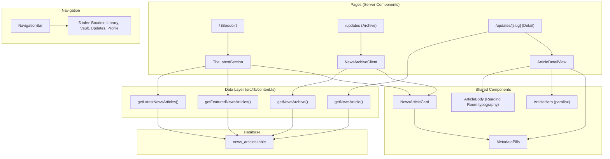

# Design: News and Updates System

## Overview

The News and Updates System adds editorial, campaign, and auto-generated content to Midnight Satin. It introduces a `news_articles` database table, content-fetching functions in `src/lib/content.ts`, a "THE LATEST" section on The Boudoir home page, an article detail view at `/updates/[slug]`, a news archive at `/updates`, and a fifth "Updates" tab in the navigation bar.

The system reuses existing patterns throughout: ISR with 60s revalidation, server components for data fetching, the `MetadataPills` component for tag rendering (ensuring styling parity between novel genre tags and news article tags), the parallax hero layout from the novel detail page, and Reading Room typography for article body content.

### Key Design Decisions

1. **Shared `MetadataPills` component** — News article tags reuse the existing `MetadataPills` component (`src/app/_components/metadata-pills.tsx`) that already renders novel genre tags. No new tag component is created. This guarantees pixel-perfect styling parity (Requirement 5).

2. **Slug-based routing** — Article detail pages use `/updates/[slug]` rather than UUID-based routes, providing human-readable URLs and SEO benefits. Slugs are unique and indexed.

3. **Attribution as a derived value** — Attribution text is stored in the `attribution` column but has sensible defaults derived from `article_type`. The `getAttribution()` helper centralizes this logic.

4. **Cursor-based pagination** — The archive page uses `published_at` cursor pagination matching the pattern used elsewhere in the app, avoiding offset-based pagination performance issues.

5. **No separate news content module** — News fetching functions are added to the existing `src/lib/content.ts` to maintain the single content data layer pattern.

## Architecture



### File Structure

```
src/
├── app/
│   ├── _components/
│   │   ├── metadata-pills.tsx          # EXISTING — shared by novels AND news
│   │   ├── navigation-bar.tsx          # MODIFIED — add "updates" tab
│   │   ├── news-article-card.tsx       # NEW — card for Boudoir + archive
│   │   └── the-latest-section.tsx      # NEW — Boudoir home section
│   ├── updates/
│   │   ├── page.tsx                    # NEW — archive page /updates
│   │   └── [slug]/
│   │       └── page.tsx                # NEW — article detail /updates/[slug]
│   └── page.tsx                        # MODIFIED — add TheLatestSection
├── lib/
│   ├── content.ts                      # MODIFIED — add news fetching functions
│   ├── navigation.ts                   # MODIFIED — add newsArchivePath, newsArticlePath
│   └── db/
│       ├── schema.sql                  # MODIFIED — add news_articles table
│       ├── types.ts                    # MODIFIED — add NewsArticle types
│       └── seed-news.sql               # NEW — seed data
```

## Components and Interfaces

### 1. MetadataPills (Existing — No Changes)

The existing `MetadataPills` component at `src/app/_components/metadata-pills.tsx` already renders tags with the exact styling required:

```tsx
// Already exists — used by ParallaxHero for novel genre tags
// Now also used by NewsArticleCard and article detail page
<MetadataPills tags={article.tags} />
```

Styling: `px-3 py-1 text-xs tracking-wider uppercase border border-primary/60 text-primary rounded-sm bg-void/50 backdrop-blur-sm`

This is the single source of truth for pill/tag styling across the entire app.

### 2. NewsArticleCard (New)

Location: `src/app/_components/news-article-card.tsx`

```tsx
interface NewsArticleCardProps {
  article: NewsArticleSummary;
  className?: string;
}
```

Renders: hero image (16:9), title (Playfair Display italic bold), attribution (Marcellus, muted), 2-line summary (Literata, line-clamp-2), tags via `MetadataPills`. Gold border (`border-primary/40`). Links to `/updates/[slug]`.

Uses existing `.card`, `.overlay-sheen` CSS classes. Mobile: ~280px width in horizontal scroll. Tablet/desktop: fills grid cell.

### 3. TheLatestSection (New)

Location: `src/app/_components/the-latest-section.tsx`

```tsx
interface TheLatestSectionProps {
  articles: NewsArticleSummary[];
}
```

Server component. Section header "THE LATEST" in Cinzel uppercase with tracking matching `HighSocietySection`. Up to 3 articles. Mobile: horizontal scroll. Tablet: 2-col grid. Desktop: 3-col grid. "View All" link to `/updates`. Hidden when `articles.length === 0`.

### 4. Article Detail Page

Location: `src/app/updates/[slug]/page.tsx`

Server component with ISR 60s. Layout:
- **ArticleHero**: Parallax hero with hero image, gradient fade, title overlay (Playfair Display italic), attribution line, `MetadataPills` for tags
- **Summary**: Italic lead paragraph (Literata), ornamental divider
- **Body**: Reading Room typography — Literata 18px, 1.6 line-height, justified, 24px margins, `drop-cap` on first paragraph, `reading-max-width` (720px)
- **Campaign CTA**: For campaign articles with `source_url`, a `btn-gold` "Visit Campaign" button opening in new tab
- **Source platform**: Label/icon near attribution for campaign articles
- **Back button**: Navigates to previous page or `/`

### 5. News Archive Page

Location: `src/app/updates/page.tsx`

Server component with ISR 60s. Header "THE GAZETTE" in Cinzel uppercase gold. Reverse chronological order. Cursor-based pagination with "Load More" button (client component for load-more interaction). Uses `NewsArticleCard`. Responsive grid: 1 col mobile, 2 col tablet, 3 col desktop (`responsive-grid-1-2-3`). NavigationBar with `activeTab="updates"`.

### 6. NavigationBar Updates

Modify `src/app/_components/navigation-bar.tsx`:
- Extend `NavTab` type: `"boudoir" | "library" | "vault" | "updates" | "profile"`
- Add tab: `{ id: "updates", href: "/updates", label: "Updates", icon: "newspaper" }`
- Position: between Vault and Profile (index 3 in TABS array)

### 7. Navigation Helpers

Add to `src/lib/navigation.ts`:

```tsx
export function newsArchivePath(): string {
  return "/updates";
}

export function newsArticlePath(slug: string): string {
  return `/updates/${encodeURIComponent(slug)}`;
}
```

### 8. Attribution Helper

Add to `src/lib/content.ts` or as a utility:

```tsx
export function getNewsAttribution(article: { articleType: NewsArticleType; attribution: string }): string {
  switch (article.articleType) {
    case "editorial":
    case "announcement":
      return "From the Editor";
    case "ranking":
    case "popularity":
      return "Staff";
    case "campaign":
      return article.attribution || "Staff";
  }
}
```

## Data Models

### Database Table: `news_articles`

```sql
CREATE TABLE news_articles (
  id UUID PRIMARY KEY DEFAULT gen_random_uuid(),
  title TEXT NOT NULL,
  slug TEXT UNIQUE NOT NULL,
  article_type TEXT NOT NULL CHECK (article_type IN ('editorial', 'campaign', 'ranking', 'popularity', 'announcement')),
  hero_image_url TEXT,
  summary TEXT NOT NULL,
  body_content TEXT NOT NULL,
  tags TEXT[] DEFAULT '{}',
  attribution TEXT NOT NULL,
  source_url TEXT,
  source_platform TEXT CHECK (source_platform IS NULL OR source_platform IN ('tiktok', 'instagram', 'x', 'youtube', 'facebook')),
  is_published BOOLEAN DEFAULT FALSE,
  is_featured BOOLEAN DEFAULT FALSE,
  featured_order INT,
  published_at TIMESTAMPTZ,
  created_at TIMESTAMPTZ DEFAULT NOW(),
  updated_at TIMESTAMPTZ DEFAULT NOW()
);

CREATE INDEX idx_news_articles_published_at ON news_articles(published_at DESC);
CREATE INDEX idx_news_articles_type ON news_articles(article_type);
CREATE INDEX idx_news_articles_featured ON news_articles(is_featured) WHERE is_featured = true;
CREATE INDEX idx_news_articles_slug ON news_articles(slug);
```

### TypeScript Types

Added to `src/lib/db/types.ts`:

```typescript
export type NewsArticleType = 'editorial' | 'campaign' | 'ranking' | 'popularity' | 'announcement';

export type SourcePlatform = 'tiktok' | 'instagram' | 'x' | 'youtube' | 'facebook';

export interface NewsArticle {
  id: string;
  title: string;
  slug: string;
  articleType: NewsArticleType;
  heroImageUrl: string | null;
  summary: string;
  bodyContent: string;
  tags: string[];
  attribution: string;
  sourceUrl: string | null;
  sourcePlatform: SourcePlatform | null;
  isPublished: boolean;
  isFeatured: boolean;
  featuredOrder: number | null;
  publishedAt: Date | null;
  createdAt: Date;
  updatedAt: Date;
}

/** List view type — omits body_content for performance */
export type NewsArticleSummary = Omit<NewsArticle, 'bodyContent'>;
```

### Content Fetching Functions

Added to `src/lib/content.ts`:

```typescript
// All functions filter by is_published = true

async function getLatestNewsArticles(limit: number = 3): Promise<NewsArticleSummary[]>
// ORDER BY published_at DESC LIMIT $limit

async function getFeaturedNewsArticles(limit: number = 3): Promise<NewsArticleSummary[]>
// WHERE is_featured = true ORDER BY featured_order ASC NULLS LAST LIMIT $limit

async function getNewsArticle(slug: string): Promise<NewsArticle | null>
// WHERE slug = $slug AND is_published = true

async function getNewsArchive(cursor?: string, limit?: number): Promise<{ articles: NewsArticleSummary[]; nextCursor: string | null }>
// Cursor = published_at ISO string. WHERE published_at < $cursor ORDER BY published_at DESC LIMIT $limit+1
// If rows > limit, pop last and set nextCursor = last.publishedAt
```

### Row Mapping

Following the existing `rowToNovel` pattern:

```typescript
interface NewsArticleRow {
  id: string;
  title: string;
  slug: string;
  article_type: string;
  hero_image_url: string | null;
  summary: string;
  body_content: string;
  tags: string[];
  attribution: string;
  source_url: string | null;
  source_platform: string | null;
  is_published: boolean;
  is_featured: boolean;
  featured_order: number | null;
  published_at: Date | null;
  created_at: Date;
  updated_at: Date;
}

function rowToNewsArticle(row: NewsArticleRow): NewsArticle { ... }
function rowToNewsArticleSummary(row: Omit<NewsArticleRow, 'body_content'>): NewsArticleSummary { ... }
```


## Correctness Properties

*A property is a characteristic or behavior that should hold true across all valid executions of a system — essentially, a formal statement about what the system should do. Properties serve as the bridge between human-readable specifications and machine-verifiable correctness guarantees.*

### Property 1: News article row mapping round-trip

*For any* valid `NewsArticle` object, converting it to a database row representation and back via `rowToNewsArticle` should produce an equivalent object (with appropriate type coercions for dates and arrays).

**Validates: Requirements 1.1**

### Property 2: Latest articles are published and ordered

*For any* set of news articles in the database (with varying `is_published`, `published_at` values), calling `getLatestNewsArticles(limit)` should return only articles where `is_published = true`, ordered by `published_at` descending, with length ≤ `limit`.

**Validates: Requirements 2.1, 2.5**

### Property 3: Featured articles are published, featured, and ordered

*For any* set of news articles in the database, calling `getFeaturedNewsArticles(limit)` should return only articles where both `is_published = true` and `is_featured = true`, ordered by `featured_order` ascending (nulls last), with length ≤ `limit`.

**Validates: Requirements 2.2, 2.5**

### Property 4: Get article by slug returns correct result

*For any* slug string, `getNewsArticle(slug)` should return the matching published article if one exists with that slug and `is_published = true`, or `null` otherwise. It should never return an unpublished article.

**Validates: Requirements 2.3, 2.5**

### Property 5: Archive pagination correctness

*For any* set of published news articles and any valid cursor (a `published_at` ISO timestamp), `getNewsArchive(cursor, limit)` should return articles with `published_at` strictly before the cursor, ordered by `published_at` descending, with length ≤ `limit`. If more articles exist beyond the page, `nextCursor` should be non-null and usable to fetch the next page without duplicates or gaps.

**Validates: Requirements 2.4, 9.2, 9.3**

### Property 6: Attribution logic correctness

*For any* news article, `getNewsAttribution` should return: "From the Editor" when `articleType` is `editorial` or `announcement`; "Staff" when `articleType` is `ranking` or `popularity`; and for `campaign` type, the custom `attribution` value if non-empty, otherwise "Staff".

**Validates: Requirements 8.1, 8.2, 8.3, 11.4**

### Property 7: News article card renders all required fields

*For any* `NewsArticleSummary` with non-empty title, attribution, summary, and tags, the `NewsArticleCard` component output should contain the article title, the attribution text, the summary text, all tag strings, and a link to `/updates/{slug}`.

**Validates: Requirements 4.1, 4.4, 5.4, 8.4**

### Property 8: Campaign article detail shows CTA and platform

*For any* news article of type `campaign` with a non-null `source_url`, the article detail view should render a "Visit Campaign" link pointing to that `source_url`. When `source_platform` is also non-null, the platform name should appear in the rendered output. For non-campaign articles, no "Visit Campaign" CTA should be present.

**Validates: Requirements 6.7, 6.9, 12.3, 12.4**

### Property 9: Navigation path construction

*For any* non-empty slug string, `newsArticlePath(slug)` should produce a string matching the pattern `/updates/{encodedSlug}`, and `newsArchivePath()` should always return `"/updates"`.

**Validates: Requirements 4.4, 6.1, 9.1, 10.4**

## Error Handling

| Scenario | Handling |
|---|---|
| Database unavailable | Content fetching functions return empty arrays / null (matching existing `try/catch` pattern in `content.ts`). Boudoir hides "THE LATEST" section. Archive shows empty state. |
| Article not found (invalid slug) | `getNewsArticle` returns `null` → detail page calls `notFound()` (Next.js 404). |
| Unpublished article accessed by slug | Same as not found — `getNewsArticle` filters by `is_published = true`. |
| Missing hero image | Card and detail view render a fallback placeholder (surface background with `article` Material Symbol icon). |
| Empty tags array | `MetadataPills` already handles empty arrays by returning `null`. No tags rendered. |
| Invalid cursor in pagination | `getNewsArchive` treats invalid cursor as no cursor (returns first page). |
| Campaign article with null source_url | "Visit Campaign" CTA is not rendered. Only shown when `source_url` is non-null. |
| Empty body_content | Detail page renders summary only with no body section. Edge case handled gracefully. |

## Testing Strategy

### Unit Tests

Unit tests cover specific examples, edge cases, and integration points:

- **Seed data validation**: Verify seed SQL produces ≥5 articles covering all 5 types, ≥2 featured, ≥1 campaign with source_url/source_platform (Req 13)
- **Navigation tab order**: Verify TABS array is `[boudoir, library, vault, updates, profile]` with correct icons and hrefs (Req 10)
- **Empty state**: TheLatestSection renders nothing when articles array is empty (Req 3.6)
- **Article detail 404**: Detail page calls `notFound()` when slug doesn't match a published article
- **Summary truncation**: Card renders summary with line-clamp-2 class; detail renders full summary
- **MetadataPills reuse**: Both novel ParallaxHero and NewsArticleCard import and use the same `MetadataPills` component (Req 5.3)

### Property-Based Tests

Property-based tests verify universal correctness properties across randomized inputs. Use `fast-check` as the PBT library.

Each test runs a minimum of 100 iterations and is tagged with its design property reference.

- **Feature: news-updates-system, Property 1: News article row mapping round-trip** — Generate random NewsArticle objects, convert to row and back, assert equivalence.
- **Feature: news-updates-system, Property 2: Latest articles are published and ordered** — Generate random article sets, verify getLatestNewsArticles returns only published articles in descending published_at order within limit.
- **Feature: news-updates-system, Property 3: Featured articles are published, featured, and ordered** — Generate random article sets, verify getFeaturedNewsArticles returns only published+featured articles ordered by featured_order.
- **Feature: news-updates-system, Property 4: Get article by slug returns correct result** — Generate random articles with random slugs and published states, verify getNewsArticle returns correct article or null.
- **Feature: news-updates-system, Property 5: Archive pagination correctness** — Generate random published article sets, paginate through all pages, verify no duplicates, no gaps, correct ordering.
- **Feature: news-updates-system, Property 6: Attribution logic correctness** — Generate random article types and attribution strings, verify getNewsAttribution output matches the rules.
- **Feature: news-updates-system, Property 7: News article card renders all required fields** — Generate random NewsArticleSummary objects, render NewsArticleCard, verify output contains title, attribution, summary, tags, and correct link.
- **Feature: news-updates-system, Property 8: Campaign article detail shows CTA and platform** — Generate random campaign and non-campaign articles, verify CTA presence/absence and platform display.
- **Feature: news-updates-system, Property 9: Navigation path construction** — Generate random slug strings, verify newsArticlePath produces correct URL pattern.

### Test Configuration

```typescript
// fast-check configuration for all property tests
import fc from "fast-check";

const PBT_CONFIG = { numRuns: 100 };

// Example property test structure:
// test("Property 6: Attribution logic correctness", () => {
//   fc.assert(
//     fc.property(
//       fc.record({
//         articleType: fc.constantFrom("editorial", "campaign", "ranking", "popularity", "announcement"),
//         attribution: fc.string(),
//       }),
//       (article) => {
//         const result = getNewsAttribution(article);
//         // ... assertions
//       }
//     ),
//     PBT_CONFIG
//   );
// });
```
