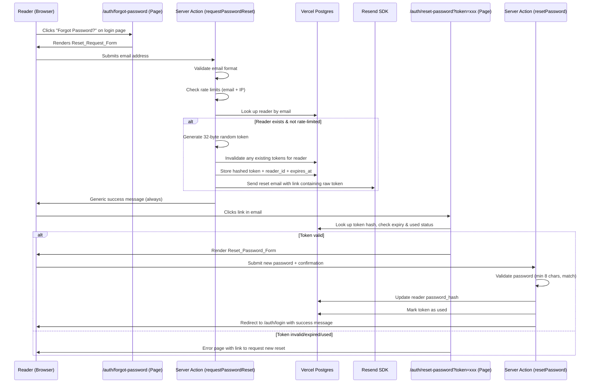
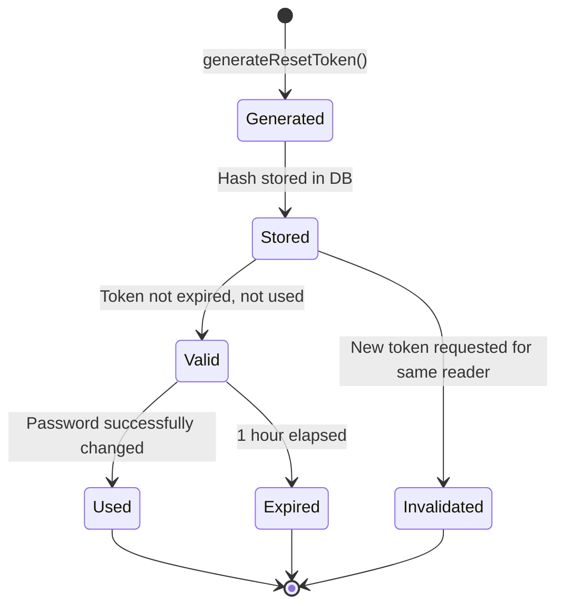

# Design Document: Password Recovery & Resend

## Overview

This design describes the password recovery flow for the Midnight Satin romance reading platform. A reader who has forgotten their password can request a reset via email. The system generates a cryptographically secure token, sends a branded email via the Resend SDK, and allows the reader to set a new password through a validated form. The feature includes rate limiting, security logging, and environment-based configuration.

The flow integrates into the existing Next.js 16 App Router architecture, reusing the current `src/lib/auth/` modules for password hashing and session management, and extending the Vercel Postgres schema with a `password_reset_tokens` table.

## Architecture



The architecture follows a two-phase pattern:

1. **Request Phase** — `/auth/forgot-password` page with a server action that validates, rate-limits, generates a token, stores its hash, and dispatches an email via Resend. Always returns a generic confirmation to prevent email enumeration.

2. **Reset Phase** — `/auth/reset-password` page that validates the token from the URL query parameter, renders the password form if valid, and processes the password update via a second server action.

Both phases use Next.js server actions for form handling, consistent with the existing `loginFormAction` / `registerFormAction` pattern in `src/app/actions/auth.ts`.

## Components and Interfaces

### New Files

| File | Purpose |
|------|---------|
| `src/app/auth/forgot-password/page.tsx` | Server component for the forgot password page |
| `src/app/auth/forgot-password/forgot-password-form.tsx` | Client component with email input form |
| `src/app/auth/reset-password/page.tsx` | Server component that validates token and renders form or error |
| `src/app/auth/reset-password/reset-password-form.tsx` | Client component with new password + confirmation form |
| `src/app/actions/password-reset.ts` | Server actions: `requestPasswordResetAction`, `resetPasswordAction` |
| `src/lib/auth/password-reset.ts` | Core logic: token generation, hashing, validation, rate limiting |
| `src/lib/auth/resend.ts` | Resend SDK wrapper: email sending, template rendering |

### Modified Files

| File | Change |
|------|--------|
| `src/app/auth/login/login-form.tsx` | Add "Forgot Password?" link below password field |
| `src/lib/db/index.ts` | Add query helpers for password_reset_tokens table |
| `src/middleware.ts` | No changes needed — reset pages are public |

### Key Interfaces

```typescript
// src/lib/auth/password-reset.ts

export interface ResetTokenResult {
  token: string;        // Raw token (sent in email, never stored)
  tokenHash: string;    // SHA-256 hash (stored in DB)
  expiresAt: Date;      // 1 hour from generation
}

export interface TokenValidationResult {
  valid: boolean;
  readerId?: string;
  error?: 'invalid' | 'expired' | 'used';
}

export interface RateLimitCheck {
  allowed: boolean;
  retryAfterSeconds?: number;
}

/** Generate a cryptographically secure reset token */
export function generateResetToken(): ResetTokenResult;

/** Hash a raw token for storage (SHA-256) */
export function hashToken(rawToken: string): string;

/** Validate a token from URL against the database */
export async function validateResetToken(rawToken: string): Promise<TokenValidationResult>;

/** Check rate limits for email and IP */
export async function checkRateLimit(email: string, ipAddress: string): Promise<RateLimitCheck>;
```

```typescript
// src/lib/auth/resend.ts

export interface SendResetEmailParams {
  to: string;
  resetUrl: string;
  expiresInMinutes: number;
}

export interface SendResetEmailResult {
  success: boolean;
  messageId?: string;
  error?: string;
}

/** Send password reset email via Resend SDK */
export async function sendResetEmail(params: SendResetEmailParams): Promise<SendResetEmailResult>;

/** Check if Resend is properly configured */
export function isResendConfigured(): boolean;
```

```typescript
// src/app/actions/password-reset.ts

export type PasswordResetRequestState = { message: string; success: boolean } | null;
export type PasswordResetState = { error: string } | null;

/** Server action for forgot-password form */
export async function requestPasswordResetAction(
  prev: PasswordResetRequestState,
  formData: FormData
): Promise<PasswordResetRequestState>;

/** Server action for reset-password form */
export async function resetPasswordAction(
  prev: PasswordResetState,
  formData: FormData
): Promise<PasswordResetState>;
```

### DB Query Helpers (added to `src/lib/db/index.ts`)

```typescript
/** Store a hashed reset token */
export async function createPasswordResetToken(
  readerId: string,
  tokenHash: string,
  expiresAt: Date
): Promise<void>;

/** Invalidate all existing tokens for a reader */
export async function invalidateResetTokensForReader(readerId: string): Promise<void>;

/** Look up a token by hash, return reader_id, expires_at, used_at */
export async function getResetTokenByHash(
  tokenHash: string
): Promise<{ readerId: string; expiresAt: Date; usedAt: Date | null } | null>;

/** Mark a token as used */
export async function markResetTokenUsed(tokenHash: string): Promise<void>;

/** Count recent reset requests for rate limiting */
export async function countRecentResetRequests(
  email: string,
  windowMinutes: number
): Promise<number>;

export async function countRecentResetRequestsByIp(
  ipAddress: string,
  windowMinutes: number
): Promise<number>;
```

## Data Models

### New Table: `password_reset_tokens`

```sql
CREATE TABLE IF NOT EXISTS password_reset_tokens (
  id UUID PRIMARY KEY DEFAULT gen_random_uuid(),
  reader_id UUID NOT NULL REFERENCES readers(id) ON DELETE CASCADE,
  token_hash TEXT NOT NULL UNIQUE,
  expires_at TIMESTAMPTZ NOT NULL,
  used_at TIMESTAMPTZ,
  created_at TIMESTAMPTZ DEFAULT NOW(),
  ip_address TEXT
);

CREATE INDEX IF NOT EXISTS idx_reset_tokens_hash ON password_reset_tokens(token_hash);
CREATE INDEX IF NOT EXISTS idx_reset_tokens_reader ON password_reset_tokens(reader_id);
CREATE INDEX IF NOT EXISTS idx_reset_tokens_created ON password_reset_tokens(created_at);
```

### New Table: `password_reset_log`

```sql
CREATE TABLE IF NOT EXISTS password_reset_log (
  id UUID PRIMARY KEY DEFAULT gen_random_uuid(),
  event_type TEXT NOT NULL CHECK (event_type IN (
    'reset_requested', 'token_generated', 'email_sent', 'email_failed',
    'token_validated', 'token_invalid', 'token_expired', 'token_used',
    'password_changed', 'rate_limited'
  )),
  reader_id UUID REFERENCES readers(id) ON DELETE SET NULL,
  ip_address TEXT,
  reason_code TEXT,
  created_at TIMESTAMPTZ DEFAULT NOW()
);

CREATE INDEX IF NOT EXISTS idx_reset_log_created ON password_reset_log(created_at);
CREATE INDEX IF NOT EXISTS idx_reset_log_reader ON password_reset_log(reader_id);
```

### TypeScript Types

```typescript
// Added to src/lib/db/types.ts

export interface PasswordResetToken {
  id: string;
  readerId: string;
  tokenHash: string;
  expiresAt: Date;
  usedAt: Date | null;
  createdAt: Date;
  ipAddress: string | null;
}

export type PasswordResetEventType =
  | 'reset_requested'
  | 'token_generated'
  | 'email_sent'
  | 'email_failed'
  | 'token_validated'
  | 'token_invalid'
  | 'token_expired'
  | 'token_used'
  | 'password_changed'
  | 'rate_limited';

export interface PasswordResetLogEntry {
  id: string;
  eventType: PasswordResetEventType;
  readerId: string | null;
  ipAddress: string | null;
  reasonCode: string | null;
  createdAt: Date;
}
```

### Token Lifecycle



### Rate Limiting Strategy

Rate limits are enforced by counting rows in `password_reset_tokens` within a sliding 1-hour window:

- **Per email**: Max 3 requests per hour (Req 6.1)
- **Per IP**: Max 10 requests per hour (Req 6.2)

The `ip_address` column on `password_reset_tokens` serves double duty — it supports rate limiting queries and security logging. The IP is extracted from the `x-forwarded-for` header (standard for Vercel deployments).

When rate limits are exceeded, the system returns the same generic success message (Req 6.3) and logs a `rate_limited` event (Req 6.4).


## Correctness Properties

*A property is a characteristic or behavior that should hold true across all valid executions of a system — essentially, a formal statement about what the system should do. Properties serve as the bridge between human-readable specifications and machine-verifiable correctness guarantees.*

### Property 1: Valid email acceptance

*For any* string that matches a valid email format (contains `@`, domain part, no whitespace), submitting it to the reset request form should not produce a validation error.

**Validates: Requirements 1.3**

### Property 2: Invalid email rejection

*For any* string that does not match a valid email format (missing `@`, whitespace-only, empty), submitting it to the reset request form should produce a validation error and not trigger any token generation.

**Validates: Requirements 1.4**

### Property 3: Response uniformity

*For any* email submission to the reset request form — whether the email exists in the system, does not exist, or is rate-limited — the user-facing response message should be identical.

**Validates: Requirements 1.5, 6.3**

### Property 4: Token generation meets minimum entropy

*For any* generated reset token, the raw token should be at least 32 bytes of random data (43+ characters when base64url-encoded), and no two generated tokens should be equal.

**Validates: Requirements 2.1, 2.2**

### Property 5: Token storage round-trip

*For any* generated reset token, the stored value in the database should not equal the raw token (it is hashed), and looking up the hash should return the correct reader ID.

**Validates: Requirements 2.3, 2.6**

### Property 6: Token expiration

*For any* reset token, validating it after 1 hour from its creation time should return an invalid/expired result, and validating it before 1 hour should return a valid result (assuming it hasn't been used or invalidated).

**Validates: Requirements 2.4**

### Property 7: Token invalidation on re-request

*For any* reader with an existing valid reset token, requesting a new token should cause the previous token to fail validation.

**Validates: Requirements 2.5**

### Property 8: Email contains reset link with token

*For any* generated reset email, the email body should contain a URL that includes the raw token as a query parameter, and the URL should point to the `/auth/reset-password` path.

**Validates: Requirements 3.1, 3.2**

### Property 9: Email failure does not change user response

*For any* reset request where the Resend service fails, the user-facing response should be identical to a successful request, and an error should be logged.

**Validates: Requirements 3.6**

### Property 10: Token validation correctness

*For any* token string, the validation function should return `valid: true` only when the token exists in the database, has not expired, and has not been used. All other cases (non-existent, expired, used) should return `valid: false`.

**Validates: Requirements 4.1, 4.2, 4.3, 4.4**

### Property 11: Token error message uniformity

*For any* invalid token (whether non-existent, expired, or already used), the error message displayed to the user should be identical across all three cases.

**Validates: Requirements 4.5**

### Property 12: Password validation rules

*For any* password string shorter than 8 characters, the reset form should reject it. *For any* pair of non-matching password and confirmation strings, the reset form should reject them.

**Validates: Requirements 5.2, 5.3**

### Property 13: Password reset round-trip

*For any* valid reset token and valid new password, after completing the reset: (a) verifying the new password against the stored hash should return true, (b) verifying the old password should return false, and (c) the used token should fail validation.

**Validates: Requirements 5.4, 5.5**

### Property 14: Email rate limiting

*For any* email address, after 3 reset requests within a 1-hour window, subsequent requests should be rate-limited (no email sent, no new token generated).

**Validates: Requirements 6.1**

### Property 15: IP rate limiting

*For any* IP address, after 10 reset requests within a 1-hour window, subsequent requests should be rate-limited regardless of the email address used.

**Validates: Requirements 6.2**

### Property 16: Security logging completeness

*For any* password reset operation (request, success, or failure), a log entry should be created with a timestamp and the appropriate event type. Request logs should include IP address, success logs should include reader ID, and failure logs should include a reason code.

**Validates: Requirements 7.1, 7.2, 7.3**

### Property 17: No sensitive data in logs

*For any* log entry in the password_reset_log table, the entry should not contain plaintext email addresses, raw tokens, or passwords in any field.

**Validates: Requirements 7.4**

### Property 18: Missing environment variables disable feature

*For any* configuration state where `RESEND_API_KEY` or `RESEND_FROM_EMAIL` is missing or empty, the `isResendConfigured()` function should return false, and reset requests should log an error without attempting to send email.

**Validates: Requirements 8.3**

## Error Handling

### User-Facing Errors

All user-facing error messages follow the principle of minimal information disclosure:

| Scenario | User Message |
|----------|-------------|
| Valid email submitted (exists or not) | "If an account with that email exists, we've sent a reset link." |
| Invalid email format | "Please enter a valid email address." |
| Rate limit exceeded | "If an account with that email exists, we've sent a reset link." (same as success) |
| Invalid/expired/used token | "This reset link is no longer valid. Please request a new one." |
| Password too short | "Password must be at least 8 characters." |
| Passwords don't match | "Passwords do not match." |
| Password reset success | Redirect to `/auth/login?reset=success` with banner: "Password updated. Please sign in." |
| Resend service down | "If an account with that email exists, we've sent a reset link." (same as success) |
| Missing env vars | Feature disabled; forgot-password page shows "Password reset is temporarily unavailable." |

### Internal Error Handling

- **Database errors**: Caught and logged. User sees generic success message for request phase, or a generic error for reset phase.
- **Resend API errors**: Caught and logged with `email_failed` event type. User sees generic success message (Req 3.6).
- **Token hash collisions**: Extremely unlikely with SHA-256 but handled by the UNIQUE constraint on `token_hash`. On collision, the request is retried once.
- **Concurrent token invalidation**: If a token is invalidated between validation and password update, the update fails gracefully and the user is shown the invalid token error.

## Testing Strategy

### Property-Based Testing

The project uses `fast-check` (already installed) with `vitest` for property-based tests. Each property test references its design document property number.

**Configuration**:
- Minimum 100 iterations per property test (use `{ numRuns: 100 }`)
- Each test tagged with: `Feature: password-recovery-resend, Property {N}: {title}`
- Tests located in `src/__tests__/properties/password-reset.test.ts`

**Pure logic properties** (no DB required):
- Property 1 & 2: Email validation — generate random strings, verify accept/reject behavior
- Property 4: Token entropy — generate multiple tokens, verify length and uniqueness
- Property 5: Token hashing — generate tokens, verify hash differs from raw and is deterministic
- Property 6: Token expiration — generate tokens with various timestamps, verify expiry logic
- Property 12: Password validation — generate random strings, verify length and match rules
- Property 17: Log sanitization — generate log entries with sensitive data, verify it's stripped

**Integration properties** (require DB, skip if no `POSTGRES_URL`):
- Property 3: Response uniformity — submit existing/non-existing emails, compare responses
- Property 7: Token invalidation — create token, request new one, verify old is invalid
- Property 10: Token validation states — create tokens in various states, verify validation
- Property 13: Password reset round-trip — full flow from token to password update
- Property 14 & 15: Rate limiting — submit multiple requests, verify cutoff behavior

### Unit Tests

Unit tests complement property tests for specific examples and edge cases:

- **Email template**: Verify email HTML contains required elements (expiry notice, security warning, branding)
- **Environment config**: Verify `isResendConfigured()` with various env var states
- **Token error uniformity** (Property 11): Specific examples of each error type producing identical messages
- **Resend SDK integration**: Mock-based tests verifying correct API calls
- **Rate limit boundary**: Exact boundary tests (request 3 succeeds, request 4 is limited)
- **Password reset redirect**: Verify redirect URL and success parameter after reset

### Test File Structure

```
src/__tests__/properties/password-reset.test.ts    # Property-based tests
src/__tests__/properties/password-reset-unit.test.ts  # Unit/example tests
```
